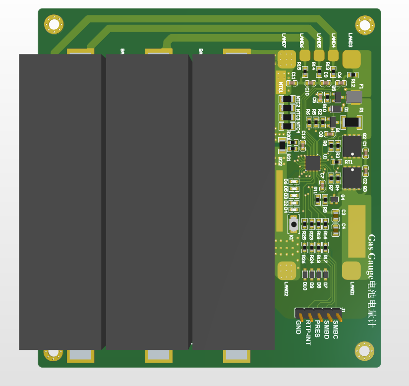
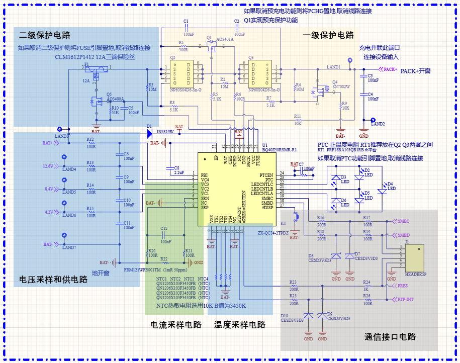
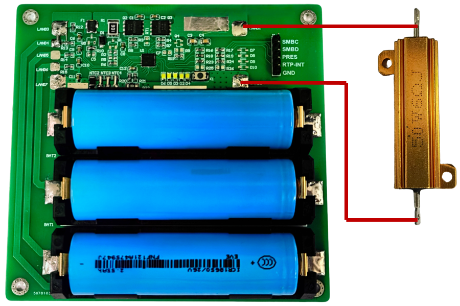

# 基于BQ40Z50电池电量计(Gas Gauge Based on BQ40Z50)


## 0. 关于本项目
关键解决移动设备电池电量测量不准确问题,本项目采用BQ40Z50RSMR-R1实现对电池运行状态监测及充放电控制;BQ40Z50RSMR-R1内部集成阻抗跟踪算法,该算法是基于锂电池电化学特性来动态学习跟踪电池阻抗,并结合负载变化来预测电池电量,兼顾电压法和库仑计数法优点的同时,支持预充电功能,可对电池进行充分激活;电池状态参数可以通过BQ40Z50RSMR-R1提供的SMBusv1.1系统管理总线接口获取,该接口兼容传统IIC通信协议,仅利用时钟线和数据线便可实现主从设备之间的信息互传.

## 1. 硬件设计
本项目在原理图部分给出了BQ40Z50RSMR-R1完整功能电路,包括供电和电压采样电路,电流采样电路,温度采样电路,一级保护电路,二级保护电路,接口交互电路,如下图所示.但实际上考虑本项目服务于本人某一特定负载应用场景,实际焊接和配置时对其进行了裁剪,取消了"二级保护电路"以及预充电功能.



## 2. 锂电池连接
连接电池时从低压侧逐级向上连接,最大支持4节串级,未使用的接口直接与高压端相短接即可.
本项目测试使用的是三节18650锂电池串级,锂电池型号参数如下:
|参数|    |     |
|---| --- | --- |
|标准电压值|3.7V| 
|满电电压值|4.2V|
|电池容量值|2550mAh| 

## 3. 固件配置
需要安装Ti官网提供的BQstudio软件对电量计进行配置(其中需要EV2400进行通信),整体配置构成可分为五步:
(具体的详细步骤参考pdf文件)
>Ti的bqStudio软件运行容易出现卡顿,进行重启即可(EV2400对Win10系统支持)
- 首先进行固件更新下载,更新版本为R2,固件后缀为srec,在Firmware文件中
- 结合硬件设计电路对BQ40Z50RSMR-R1进行具体参数配置,涉及电路保护,充电设置,外接电池参数等
- 对BQ40Z50RSMR-R1进行校准,涉及电流、电压、温度校准,校准电流推荐1-2A,本项目使用6Ω 50W功率电阻作为负载进行电流校准,如下图所示:
- 

- Program Selected Chemistry将数据写入芯片(电池化学特性加载)
- 进行多轮完整充放电,对内部阻抗跟踪算法进行训练

## 4. SMBus通信协议构建(软件设计)
电池状态参数可以通过BQ40Z50RSMR-R1提供的SMBusv1.1 系统管理总线接口获取,该接口兼容传统IIC通信协议,仅利用时钟线和数据线便可实现主从设备之间的信息互传.其中需要进行CRC校验,通信协议在Software文件内部,考虑多平台的兼容性,本项目采用模拟IIC,测试平台选用STM32标库.
```
// CRC校验函数
uint8_t calculate_crc8(uint8_t* message, uint8_t len)  // CRC-8校验 X8+X2+X+1
{
  uint8_t crc = 0;
  while (len--) {
    crc ^= (*message++);
    for (uint8_t i = 0; i < 8; i++) {
      if (crc & 0x80)
        crc = (crc << 1) ^ 0x07;
      else
        crc <<= 1;
    }
  }
  return crc;
}
```
电量计通信实例:

```
#include "bq4050.h"
int main(void) {
  delay_init();
  uart_init(115200);
  BQ4050_GPIO_Init();
  for (;;) {
    printf("==================================================\r\n");
    BQ4050_Read_Info();
    printf("电池电压(V)：%.2f\r\n", (float)bq4050.voltage / 1000.0);
    printf("电池电量(%)：%d\r\n", bq4050.relative_SOC);
    printf("电池温度(.C)：%.2f\r\n", bq4050.temperature);
    printf("电池电流(A)： %d\r\n", bq4050.current);
    printf("==================================================\r\n");
    delay_ms(1000);
  }
}
```
